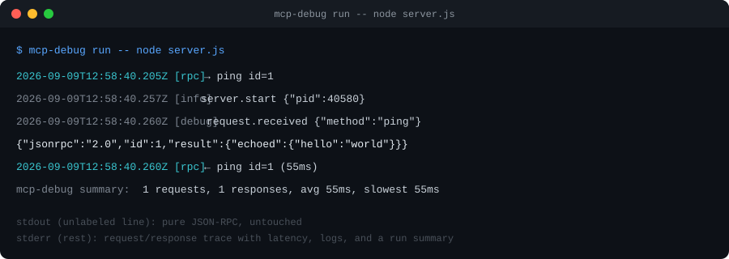

# mcp-debug

Debug logging and protocol tracing for stdio-based MCP servers.

## The problem

Stdio MCP servers use `stdout` as the JSON-RPC transport. A stray
`console.log` writes into that same stream and breaks the client's
parser — so the usual way to debug is unavailable.

## What it does

`mcp-debug` wraps your server process. `stdout` is relayed to the
client byte-for-byte, untouched. Everything useful for a human —
your debug logs and a summary of each JSON-RPC message — goes to
`stderr` and to a session log file instead.



## Install

```bash
npm i mcp-debug
```

## Usage

Wrap the command you'd normally point your MCP client at:

```bash
mcp-debug run -- node server.js
```

In your server code, swap `console.log` for the logger so output
never touches `stdout`:

```ts
import { debug, info, warn, error } from "mcp-debug";

info("server.start", { pid: process.pid });
debug("request.received", { method: "ping" });
```

Each run writes a session file to `.mcp-debug/session-<time>.jsonl`
with every log line and protocol message, in order, for later replay.

## Development

```bash
bun install
bun run build
bun run typecheck
```

## License

MIT — see [LICENSE](LICENSE).
